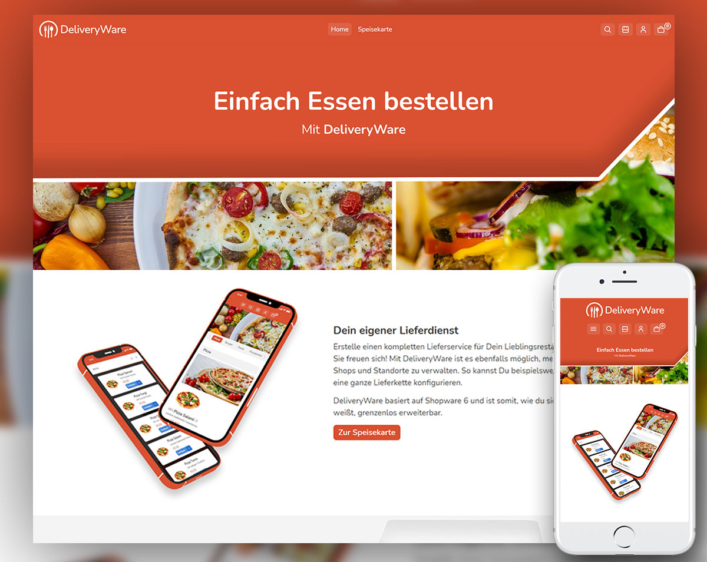
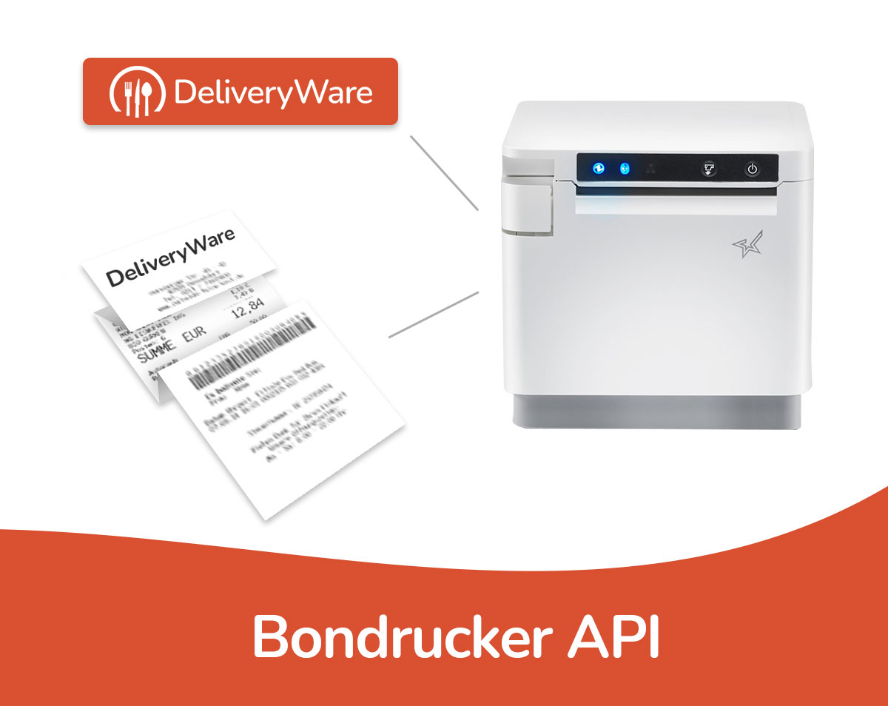
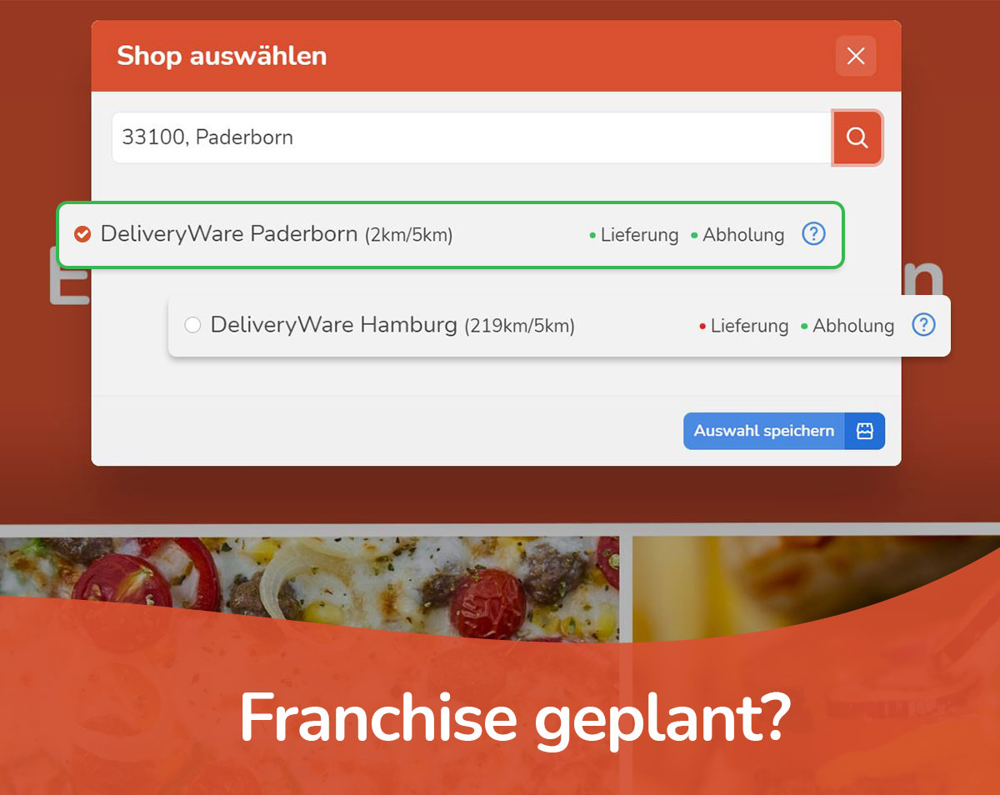
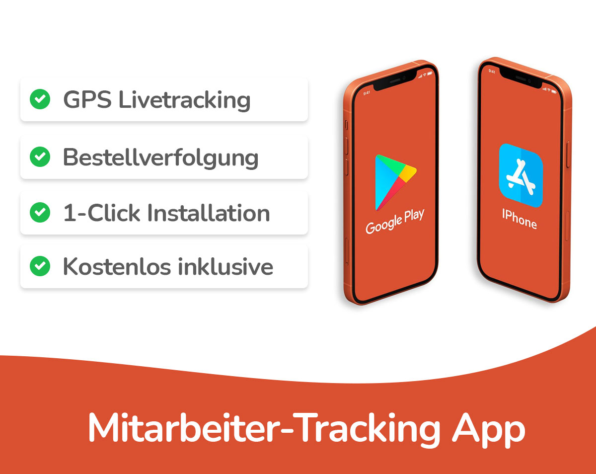
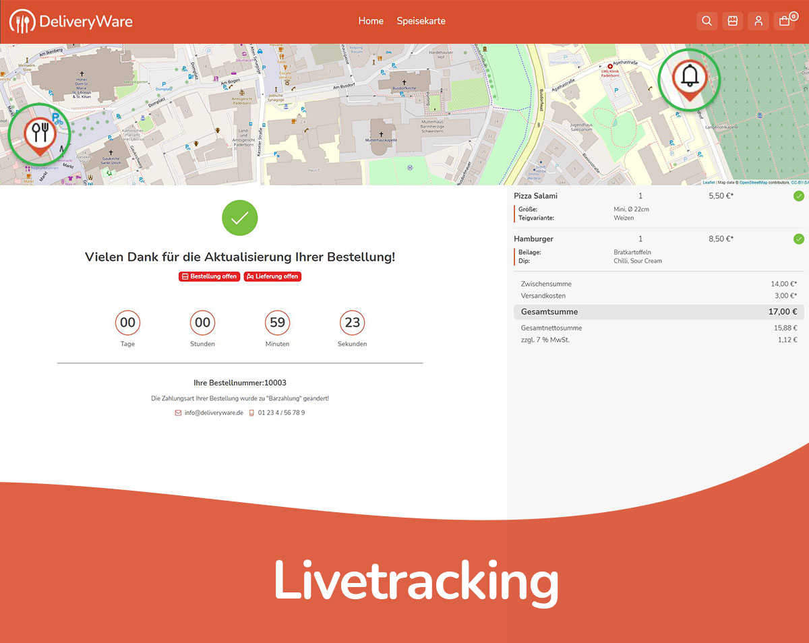
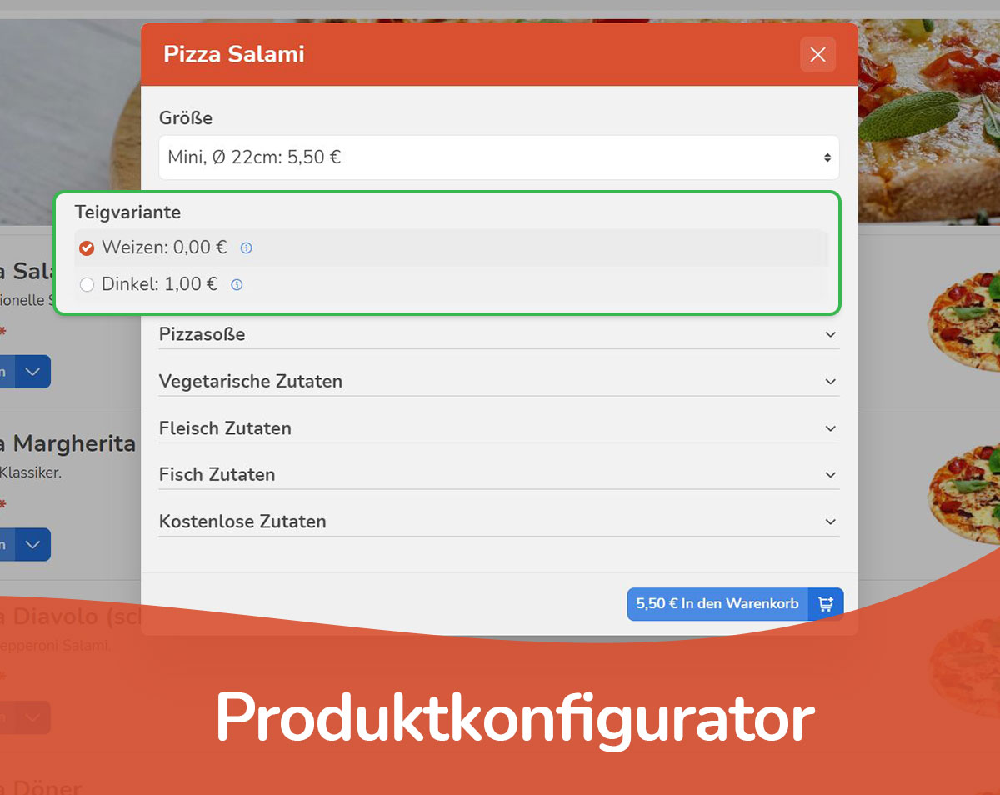

## Teaser Text
### DE
Studygood ist eine All-In-One Lösung für Deinen Online-Lieferdienst. Nützliche Funktionen unterstützen Dich für den optimalen Workflow bei der Abwicklung Deiner Bestellungen.

### EN
Studygood is an all-in-one solution for your online food delivery service. Useful functions support you for the optimal workflow when processing your orders.

## Beschreibung

Keine Lust auf veraltete Software Lösungen und ohne jegliche Reichweite? Gar kein Bock mehr auf Orange? Hier gibt es nicht nur eine Alternative - wir sind besser!

Mit Studygood bekommst Du für Dein Shopware 6 System ein Theme, eine App und nützliche Schnittstellen um Deinen Kunden ein optimales Einkaufserlebnis zu gewährleisten.

Die All-In-One Lösung beinhaltet eine für Dein Business optimierte Bestellverwaltung (Dashboard). Mit den Studygood Demo Paketen hast Du auf Anhieb passende Inhalte und Produkte - abgestimmt auf Dein Angebot.

## Highlights & Features

Folgende Funktionen sind bereits in unserer App enthalten und werden in kommenden Updates verbessert:

- Vollständig Kompatibel mit der aktuellsten Shopware 6 Version
- Optimierte Frontend-Darstellung der "Speisekarte" - Deine Kunden können ihr Lieblingsessen einfach und schnell Konfigurieren und in den Warenkorb legen
- Multi-Store-Funktion: Du kannst mehrere Standorte verwalten, jeder Standort für sich hat einen eigenen Auslieferungs-Radius, eigene Öffnungszeiten und eigene Angebote
- Store-Auswahl: Deine Kunden können sich den Store bei ihrer Bestellung aussuchen
- Wunschlieferzeit/Wunschabholzeit: Können von Dir frei und individuell Konfiguriert werden
- Ausschließung von Angeboten aus Bestimmten Stores möglich
- Lagerbestand in freien Intervallen auffüllbar: Gewisse Lebensmittel gibt es täglich nur in begrenzter Menge - z.B. Hühnereier
- Produktkonfigurator ohne Varianten - Schnell eingerichtet und auf der gesamten Kategorie Anwendebar - z.B. Pizza in 4 Größen und zusätzliche Zutaten
- Konfigurieren von "Bagdes": Verwende Deinen eigenen SVGs und hebe Produkte hervor - z.B. Peperoni/Scharf, Blatt/Vegan usw - Lasse Deine Kunden in Deinem Shop nach den Badges filtern
- Konfigurieren von Inhaltsstoffen: Allgemiene Infos für Allergiker
- Konforme Preis-pro-Brechnung: Zeige Deinen Kunden bei der Konfiguration der Gerichte immer einen Referenzpreis an - z.B. Brot: 750g, 6,67€ pro 1Kg
- Verbesserte Suche: Wir haben die Shopware Suche Grunderneuert
- Login/Registrierung: Wurde auf die wesentlich relevanten Infos verringert - Der Login-Flow wurde ebenfalls optimiert
- Automatische Validierung nach Öffnungszeiten und Umkreis: Deine Kunden können nur in einem bestimmten Umkreis und zu einer bestimmten Uhrzeit bestellen
- Zubereitungszeit/Lieferzeit: Tragen für eine geschätze Ankunftszeit bei Deinen Kunden bei
- Karte und Countdown bei der Bestellung: Zeige Deinen Kunden wie lange die Zubereitung dauert und wie der Status der Bestellung ist
- Bon-Drucker Anbindung: Drucke Deine Bestellungen direkt und einfach (ohne zusätzlich Software) auf einem netzwerkfähigen Bon-Drucker aus. Unsere App liefert eine Schnittstelle zu dem Star mC-Print2 Drucker.
- GPS Tracking: Zeige Deinen Kunden bei Statuswechsel "Lieferung" wo sich der zuständige Lieferant aktuell befindet - erspare Deinen hungrigen Kunden somit das schmächtige Warten hinter der Haustür, wenn zufällig jemand durch die Straße fährt
- Unendlich erweiterbar: Durch Drittanbieter-Apps kannst Du Deinen Shop nach Belieben optimieren und individualisieren, Deiner Kreativität sind keine Grenzen gesetzt

## FAQ

### Ist Studygood kostenlos?

Studygood ist bei der Einführung im Shopware Community Store kostenlos.
Anschließend hast Du die Möglichkeit dich für einen einmaligen Kauf oder einer
Monatlichen Miete zu entscheiden.

### Was ist die Restaurant Suchmaschine?

Die Restaurant Suchmaschine ist eine kostenlose Dienstleistung, die Du im Rahmen Deiner
App-Subscription kostenlos nutzen kannst. Derzeit befindet sich die Suchmaschine noch im
Aufbau und wird in den kommenden Updates in Studygood zur Verfügung stehen.

### Ich habe Interesse Studygood für mein Franchise zu nutzen, welche Möglichkeiten habe ich?

Mit unserer App kannst Du mehrere Standorte in einem Shop Bündeln. Aus technischer Sicht 
steht Dir also nichts im Wege. Eine Anpassung des Themes und die Anbindung an weitere
Schnittstellen sind möglich, aber nicht im Preis inklusive. Sprich uns einfach an!

### Studygood ist mit einem Shopware 6 Plugin nicht kompatibel - was kann ich tun?

Wir stehen mit den App-Entwicklern in Kontakt und versuchen immer eine gemeinsame Lösung
zu finden. Erstelle uns einfach ein Support-Ticket in Deinem Shopware Account und wir
kümmern uns darum!

### Erstellt ihr auch Shops mit/für Studygood?

Shopeinrichtungen bieten wir zu einem Festpreis an. Unser Partner-Netzwerk aus versierten
Shopware 6 Freelancern ünterstützt euch bei der Einrichtung und eventuellen Rückfragen.

### Wie funktioniert das mit dem Bon-Drucker?

Aktuell bieten wir auschließlich für ein Drucker Modell eine Schnittstelle an. Den Drucker
gibt es zu einem einmaligen Anschaffungspreis von ca. 200€ exkl. MwSt. Hilfe bei der Einrichtung
erhälst Du in unserer Dokumentation oder einem unserer Partner.

## Bilder

