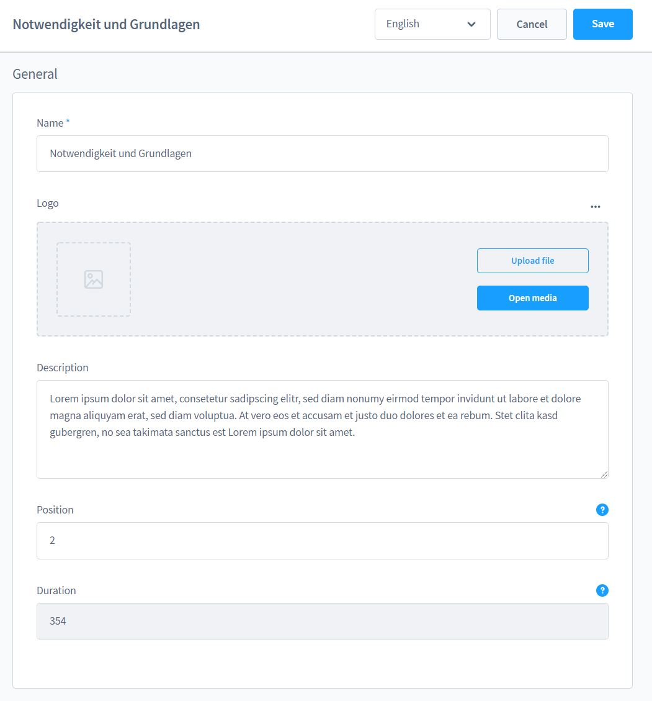

# Chapter

You can reach the detail page of the chapter or lesson by using the context menu in the
the small tables.

The position determines the order within the chapter.

The runtime tells how long this lesson is - the specification is in seconds and must be currently
entered manually.

You can edit the lessons using the context menu of the lessons in the current chapter.
