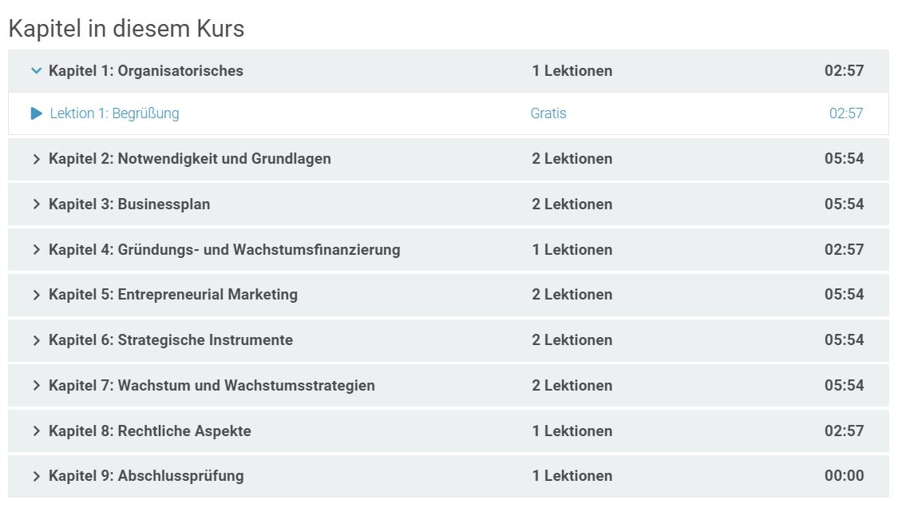
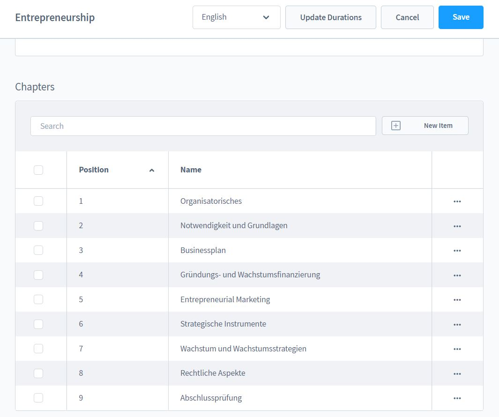
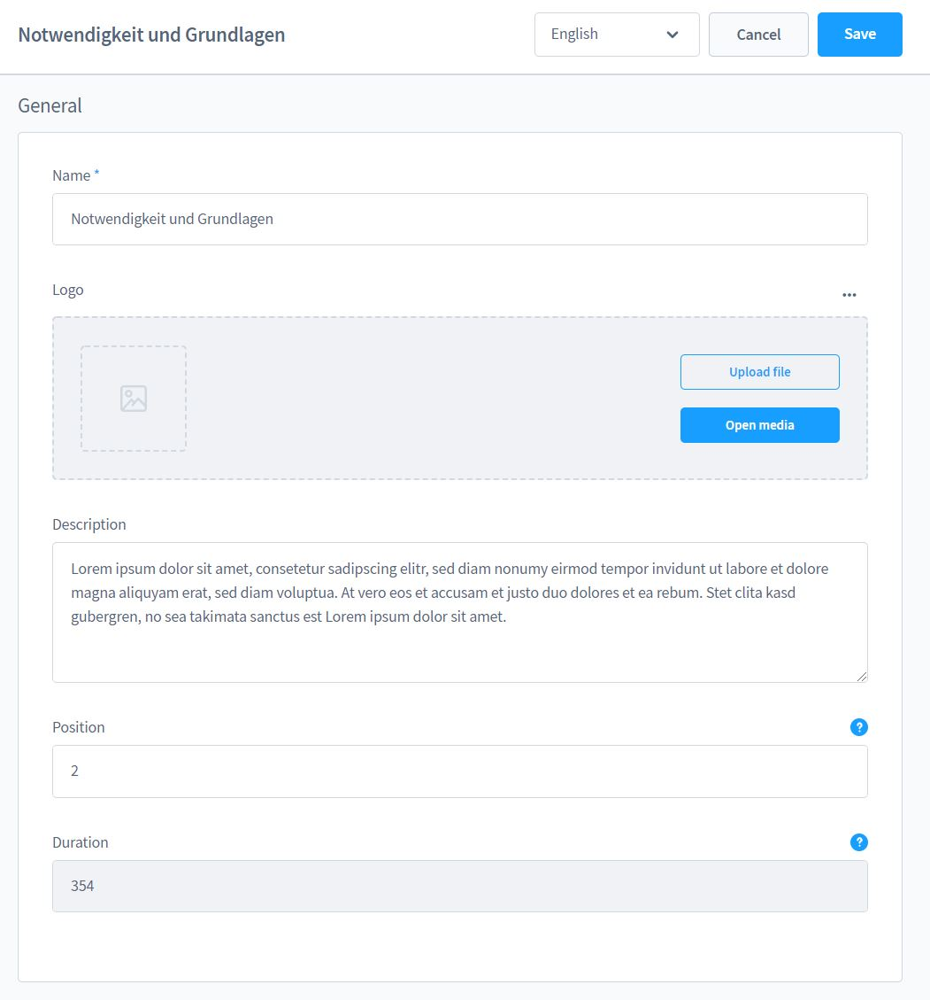
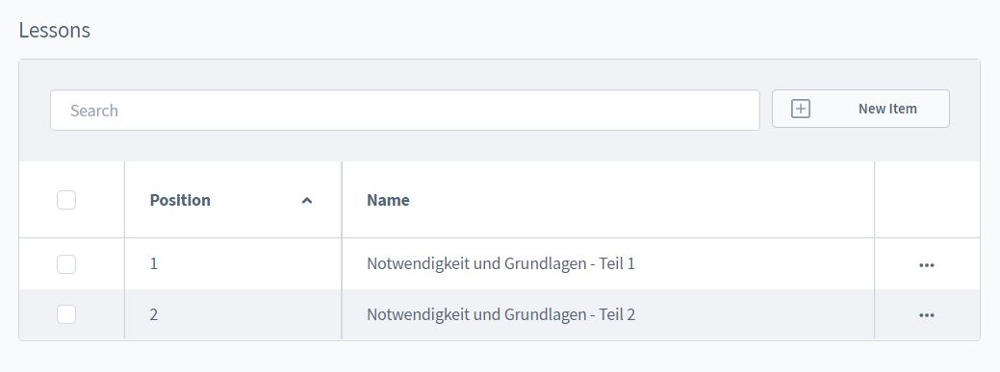

# Kapitel

Du erreichst die Detailseite des Kapitels oder der Lektion über das Kontextmenü in
den kleinen Tabellen.

Die Position bestimmt die Reihenfolge innerhalt des Kapitels.

Die Laufzeit sagt aus, wie lang diese Lektion ist - die Angabe ist in Sekunden und muss aktuell
manuell eingetragen werden.

Über das Kontextmenü der Lektionen im aktuellen Kapitel kannst du die Lektionen bearbeiten.
