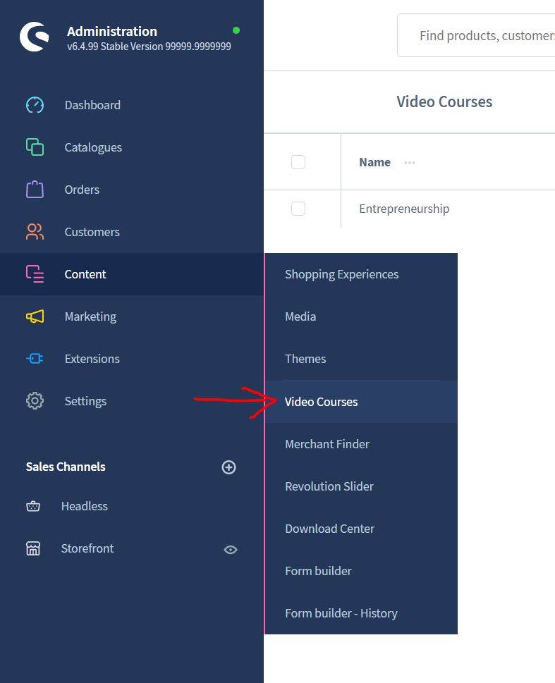
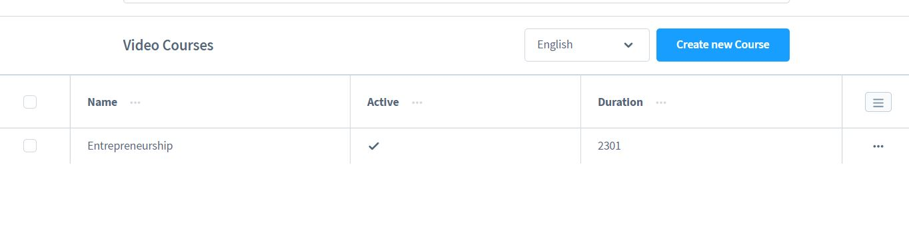
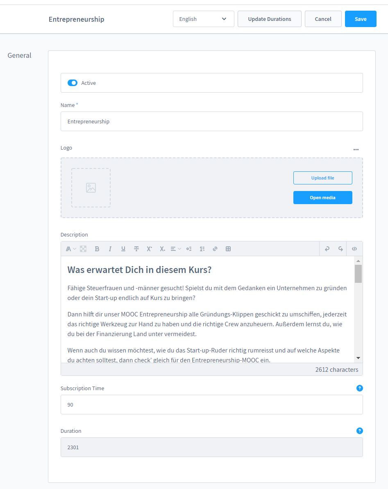
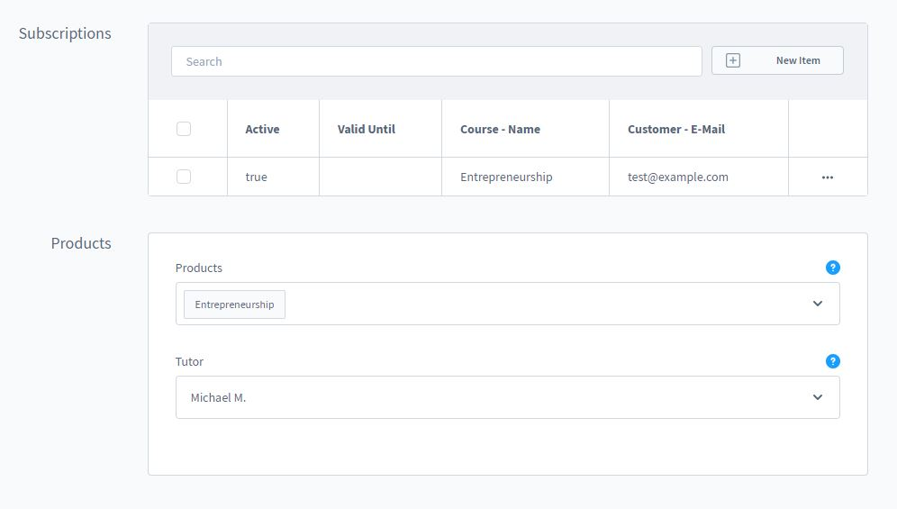
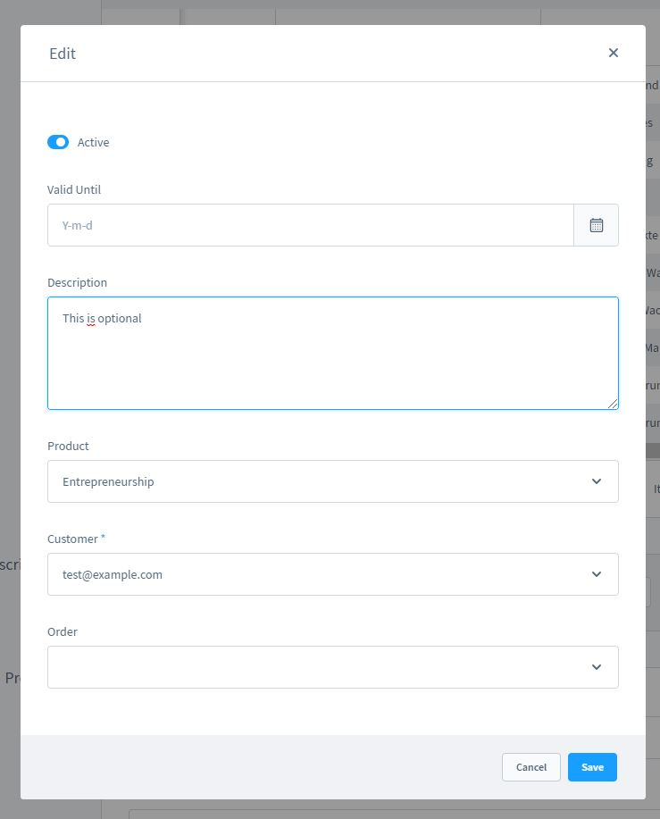

# Course management

### Create a course

Go to Video Courses via the Content menu item

Here you may already find the installed demo package? Create a new course
by clicking on "Create new course"

Here you can enter a name and a description!

After saving, more options will appear:
1. chapters - an overview of all chapters in the course
2. lessons - an overview of all lessons in the course
3. subscriptions - an overview of all subscriptions in the course
4. products - enter here the products that represent the course

Click New to create a chapter or lesson.

