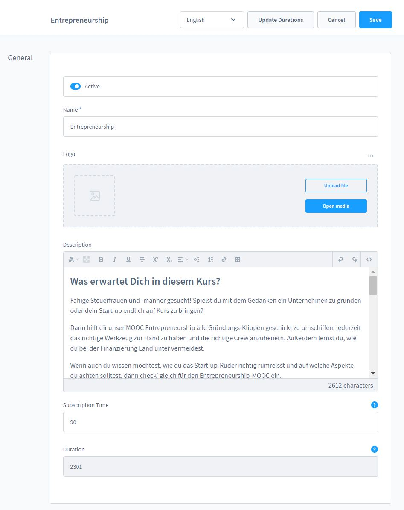
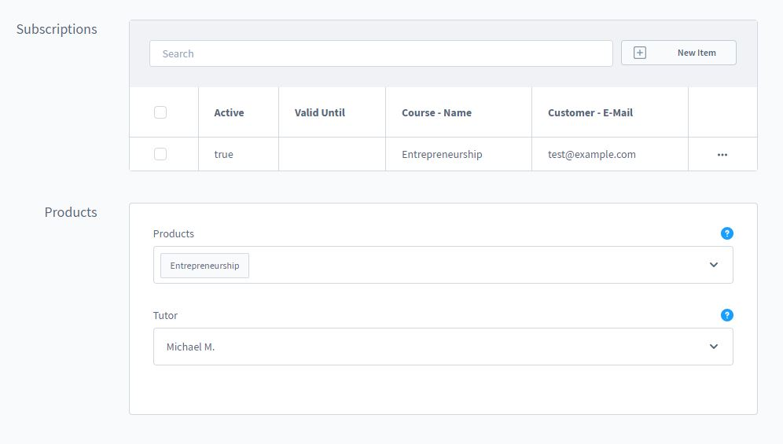

# Kursverwaltung

### Einen Kurs erstellen

Gehe über den Menüpunkt Inhalte zu Video Kurse

Hier findest du ggf. schon das installierte Demo Paket? Erstelle einen neuen Kurs
indem du auf "Neuen Kurs Erstellen" klickst

Hier kannst Du nun einen Namen, eine Beschreibung und eine Abo-Zeit eintragen!
Stelle die Abo-Zeit auf "0" Wenn Du Deinen Kurs auf unbegrenzte Zeit anbieten
möchtest.

Nach dem Speichern erscheinen weitere Optionen:
1. Kapitel - Eine Übersicht aller Kapitel in dem Kurs
2. Lektionen - Eine Übersicht aller Lektionen in dem Kurs
3. Abos - Eine Übersicht aller Buchungen des Kurses
4. Produkte - Trage hier die Produkte ein, die den Kurs repräsentieren

Klicke auf Neu um ein Kapitel oder eine Lektion zu erstellen.

Übersicht der Abonnements.

Sobald Dein Kurs fertig gestellt wurde, musst Du die Laufzeiten manuell aktualisieren. Dort
werden die Teil-Laufzeiten der Kapitel und die Gesamt-Laufzeit des Kurses gespeichert.

Du kannst nun Deinen Kurs aktivieren und im Frontend testen!