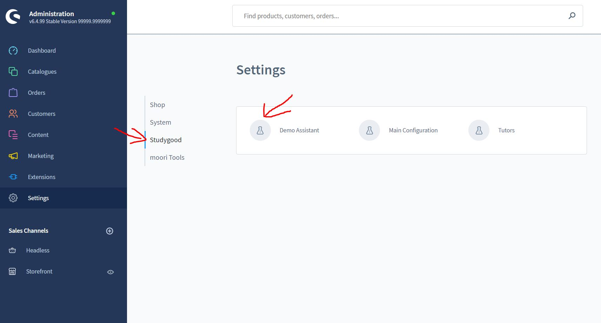

# Demo Wizard

Studygood comes with some demo data to help you with the configuration of your products.
of your products.

However, these must be installed as follows.

## Install demo data

The demo assistant is in the backend under

Settings -> Studygood -> Demo Assistant.

or

Settings -> Extensions -> Demo Assistant.

After opening the interface, a selection of packages is available under "Type".
In the future, additional demo packages will also be available for selection. These can simply be
installed as a plugin.

Under "Sales channel" the sales channels you have created are listed.
Here you have to select where the demo data should be installed.

Now just press "Install" - the demo data will be installed automatically.

###NOTE:

If other data are already installed, they must be removed before,
otherwise conflicts may occur in the database!

To do this, also select the sales channel and instead of "Install" select the "Remove" function.
function instead of "Install".