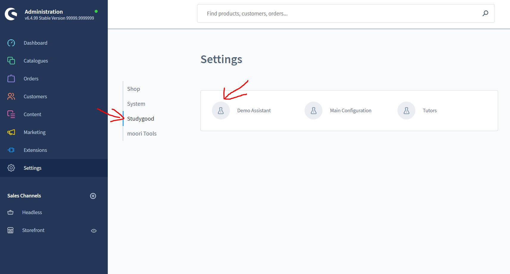
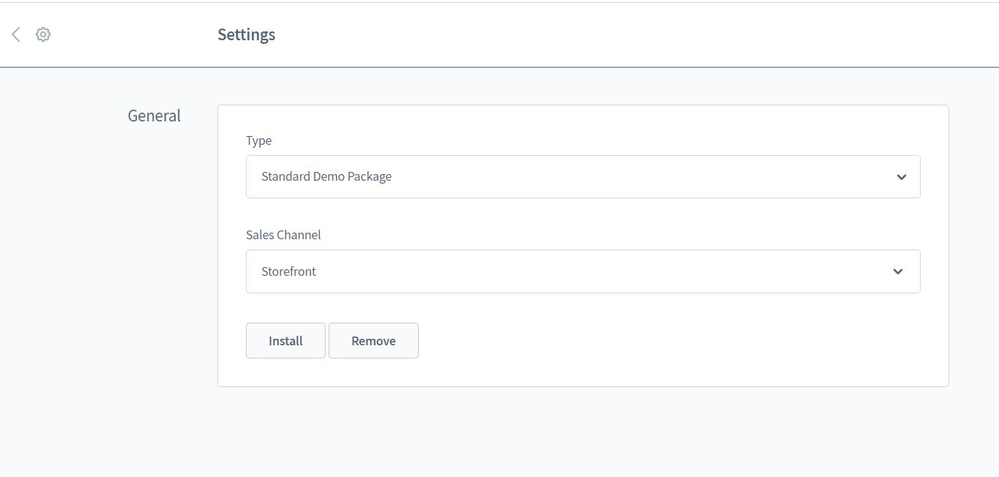

# Demo Assistent

Studygood liefert von Haus aus einige Demodaten mit, die Dir bei der Konfiguration
Deiner Produkte helfen soll.

Diese müssen jedoch wie folgt installiert werden.

## Demo Daten installieren

Der Demo Assistent ist im Backend ist unter 
Einstellungen -> Studygood -> Demo Assistent zu finden.

Nach dem Öffnenen der Oberfläche steht unter "Typ" eine Auswahl von Paketen zur Verfügung.
In der Zukunft sollen auch zusätzliche Demopakete zur Auswahl stehen. Diese können einfach
als Plugin hinzu installiert werden.

Unter "Verkaufskanal" stehen sind die von Dir erstellten Verkaufskanäle gelistet.
Hier musst Du auswählen, wohin die Demodaten installiert werden sollen.

Nun einfach auf "Installieren" drücken - die Demodaten werden automatisch installiert.

###HINWEIS:
Sollten bereits andere Daten installiert sein, müssen diese vorher entfernt werden,
da es ansonsten zu Konflikten in der Datenbank kommen kann!

Hierzu ebenfalls den Verkaufskanal auswählen und statt "Installieren" die "Entfernen"
Funktion auswählen.