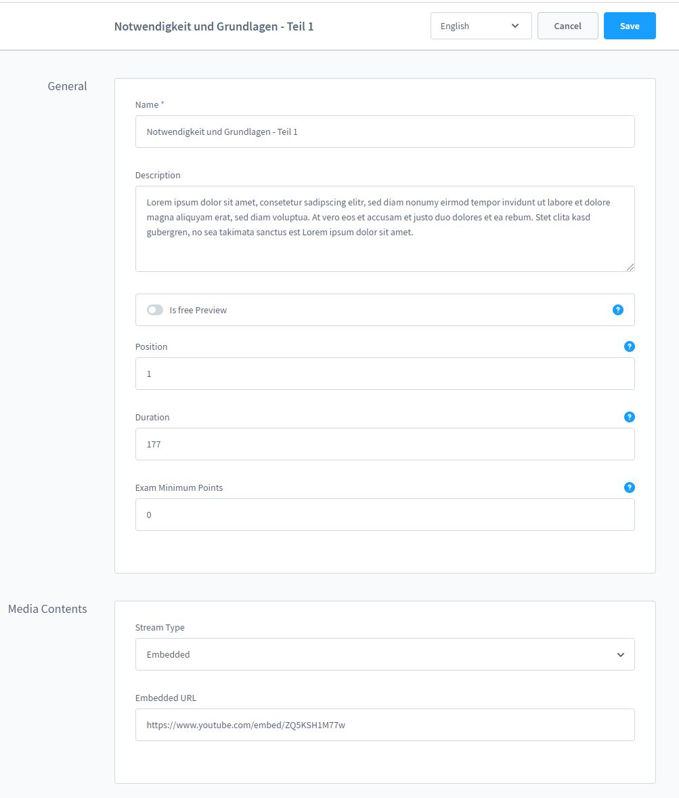
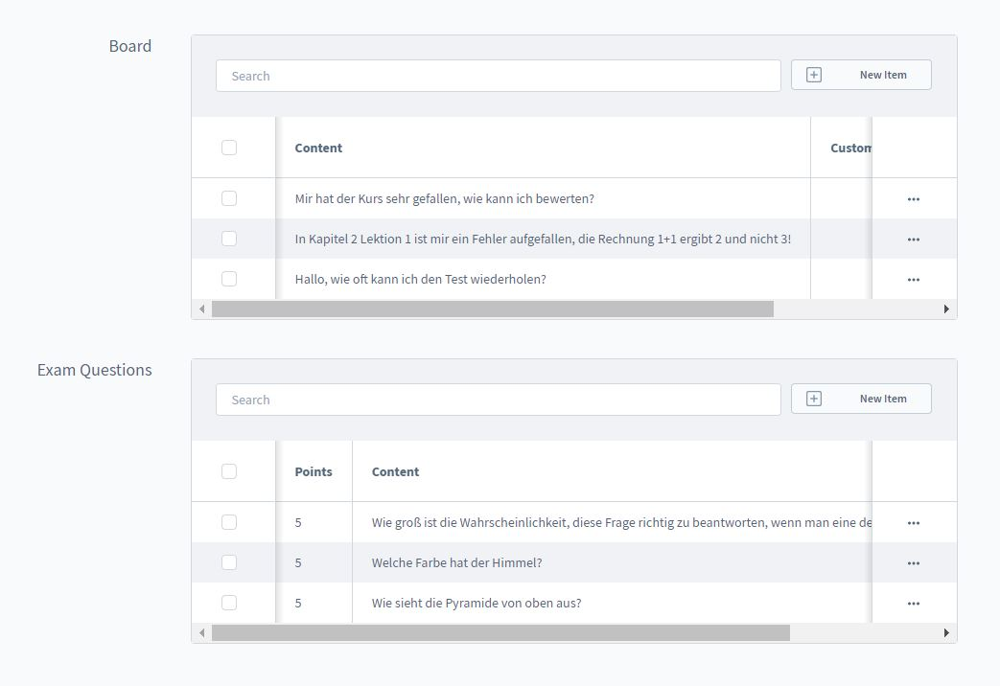

# Lessons

For the lesson you can either use your own videos from the Shopware media library or embed
embed Youtube/Vimeo videos. We recommend Vimeo, as you can protect your videos from being copied!
from being copied!

In a lesson you can add a name, a description and a cover image.

You can enter a name and a description for a lesson. There is
a button to offer the lesson to the customer as a preview - so your customer can
your customer a picture of your course.