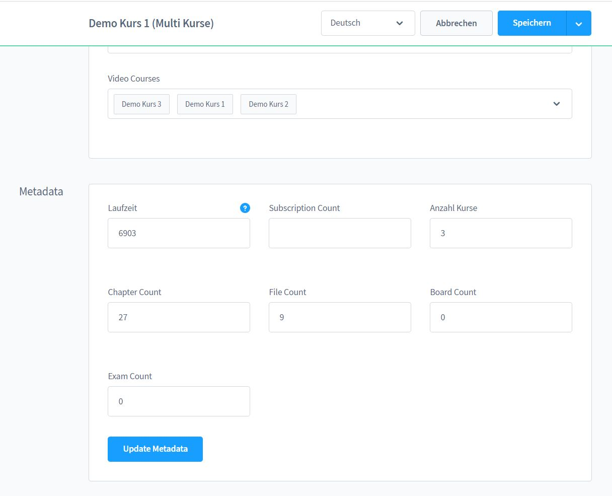

# Product configuration

Go to the product overview and then to the tab `Studygood`.
Here you will find the subscriptions, the linked courses and the meta information of the product.

Set the subscription time to "0" if you want to offer your course indefinitely.
for an unlimited time.

You can manually adjust the metadata for the product or update it automatically.
When updating, the courses will also be reindexed, so every time you make changes to one of your
changes to one of your courses, you should use this button.

After updating, click Save in the upper right corner to apply the metadata.