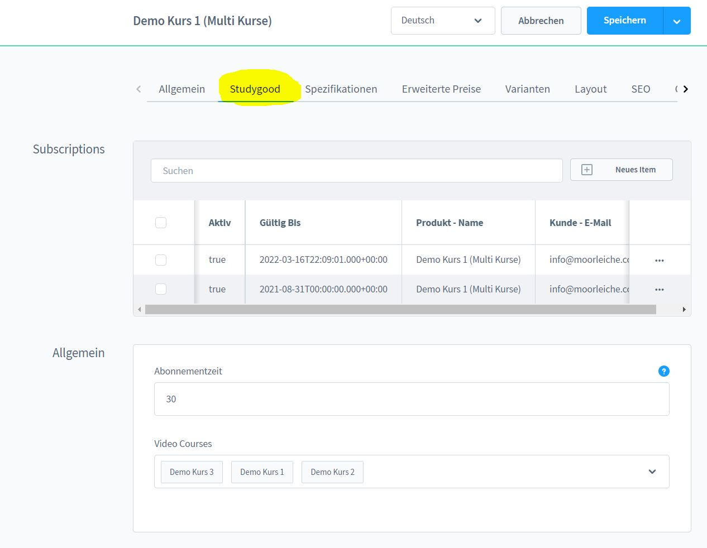
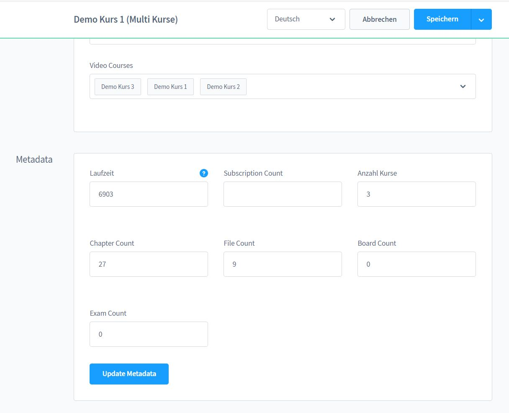

# Produkt Konfiguration

Gehe in die Produktübersicht und anschließend auf den Reiter `Studygood`.
Hier findest du die Subscriptions, die verknüpften Kurse und die Meta-Informationen des Produktes.

Stelle die Abo-Zeit auf "0" Wenn Du Deinen Kurs auf unbegrenzte Zeit anbieten
möchtest.

Du kannst die Metadaten zum Produkt manuell anpassen oder diese automatisch aktualisieren. 
Beim Aktualisieren werden die Kurse auch neu Indexiert, deshalb solltest du jedes Mal wenn Du
Änderungen an einem Deiner Kurse vornimmst, diesen Button dazu nutzen.

Klicke nach der Aktualisierung oben rechts auf Speichern um die Metadaten zu übernehmen.